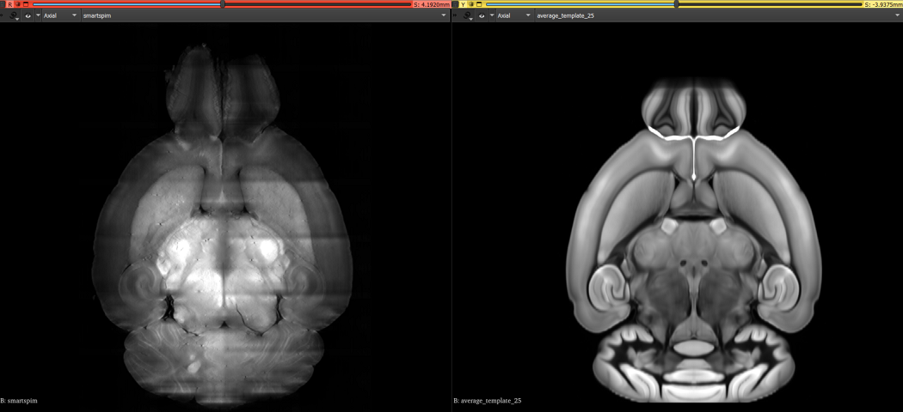
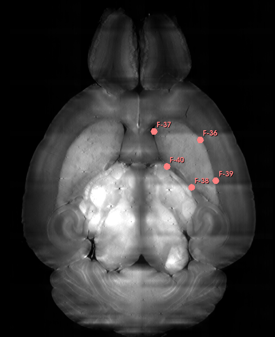
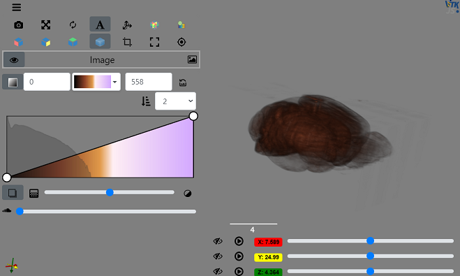

# Get Your Brain Together Hackathon 2023

This repository contains startup code to show <a href="https://insightsoftwareconsortium.github.io/GetYourBrainTogether/HCK02_2023_Allen_Institute_Hybrid/">hackathon</a> participants how to perform basic processing of example data.

## Available Scripts

Processing techniques are available in [Jupyter Notebooks](https://jupyter.org/). You can interact with notebooks in the following ways:
1. View non-interactively in CodeOcean and launch a reproducible run;
2. Launch an interactive Jupyter session in CodeOcean;
3. Download notebooks and run them locally on your PC.

The following notebooks are available:
- `RegisterToCCF`: Demonstrates a reproducible process to read in a downsampled, stitched SmartSPIM image and then run registration to map from SmartSPIM image space to the Common Coordinate Framework (CCF) atlas.

- `LocalFetchFromS3`: Demonstrates how to fetch stitched SmartSPIM image data from AWS S3 if working outside of the CodeOcean platform.

- `ApplyTransformToPointSet`: Demonstrates how to apply the transform stack result from the `RegisterToCCF` image registration pipeline to point set data.

## Tips and Tricks

We will collect useful tips for working with SmartSPIM data and registration pipelines here during the hackathon. If you find a useful hint during your work, let us know to share it here!

## Frequently Asked Questions

### Why does my ITKWidgets inline view display as text?

You may initially see ITKWidgets output as text such as the below:

> <itkwidgets.viewer.Viewer at 0x7f171826b310>

Due to a compatibility issue, you may need to launch a new CodeOcean tab with a given notebook in order for ITKWidgets views to render correctly.

Through JupyterLab:

1. Launch JupyterLab in CodeOcean
2. Navigate to the "Help" tab and launch a "classic" session
3. Click on the notebook to open it in a new browser tab
4. Run your notebook and view results in an ITKWidgets view

Through Jupyter Notebook:

1. Launch an interactive session in CodeOcean and run your notebook
2. Click on the "Jupyter" logo on the top left to return to the Jupyter start page
3. Click on the "Running" tab to see the running notebook
4. Click on the notebook to open it in CodeOcean in a new browser tab
5. Run your notebook and view results in an ITKWidgets view

